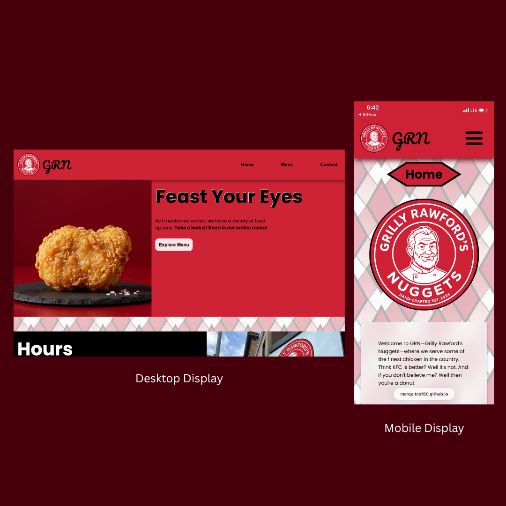

# GRN Restaurant Page

Welcome to Gordon Ramsay's fast-food restaurant, Gordon Ramsay's Nuggets (GRN). This webpage features three tabs, `home`, `menu`, and `contact`, that you can interact with. Take a look at it through this [**live demo**](https://marquitos150.github.io/restaurant-page/)!

## Project Creation & Structure
The project was built using Vanilla Javascript (ES6), with its modules for each restaurant page tab being bundled with Webpack. The default package manager for Node.js, `npm`, was used to install Webpack and its associated loaders and plugins while managing project dependencies. From there, commands like `npx webpack` and `npx webpack serve` could be run to build the project, save the bundled files to the distribution (`dist`) directory, and test changes in a development server. 

The application structure is organized around a `src` directory containing separate JavaScript modules for each restaurant page tab (`home`, `menu`, and `contact`), allowing the UI logic for each section to remain isolated and maintainable. Each module focuses on dynamically generating and returning DOM elements for its respective page content.

The main entry point of the application is `index.js`, which is responsible for handling functionality such as tab switching, event listeners, and DOM manipulation. This separation of responsibilities helped reinforce component-based thinking by keeping rendering logic independent from application control logic.

Along with DOM creation and manipulation, CSS media queries and custom properties were integrated as practice for building responsive web designs.

## Build Configuration & Tooling
The webpack configuration files were separated by environment based on [Webpack's Production Guide](https://webpack.js.org/guides/production/):

- `webpack.common.js` contains shared configuration used across all environments such as the entry point, plugins, and output configuration.
- `webpack.dev.js` extends the common configuration with development-specific features such as the `devtool` and `devServer`.
- `webpack.prod.js` extends the common configuration with production optimizations focused on performance and clean build output.

To simplify the development workflow, custom npm scripts were created inside `package.json` to save time in building, developing, and deploying the project without repeatedly typing full Webpack CLI and Git commands.

## Design Preview


## How to Run
1. Clone the repository

```bash
git clone https://github.com/marquitos150/restaurant-page.git
```

2. Navigate into the project directory

```bash
cd restaurant-page
```

3. Install all required dependencies using npm

```bash
npm install
```

4. Run the development server (opens at port 8080 automatically)

```bash
npm start
```

5. (Optional) Generate a production build inside the `dist` folder

```bash
npm run build
```

## Images
All images, backgrounds, logos, and profiles, except photos of Gordon Ramsay, were AI-generated using Gemini 3. Prompts were written to match unique and traditional fast-food items within the restaurant setting and other visual elements that complemented the overall theme and design of the project.